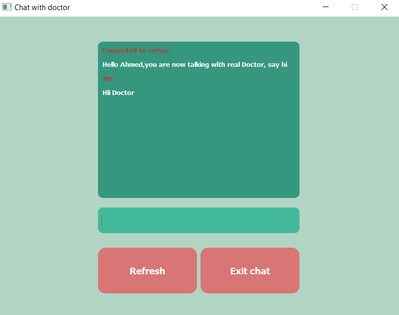

# Your-Doctor

This is a simple server-client application using socket programming related to medical domain. The application provides the user the ability to chat with medical consultant: either a real GP or a chatbot (Immediate Diagnosis). With such an app we can improve patient care and reduce the strain on healthcare systems.

 

## Samples

 

 

 

 

